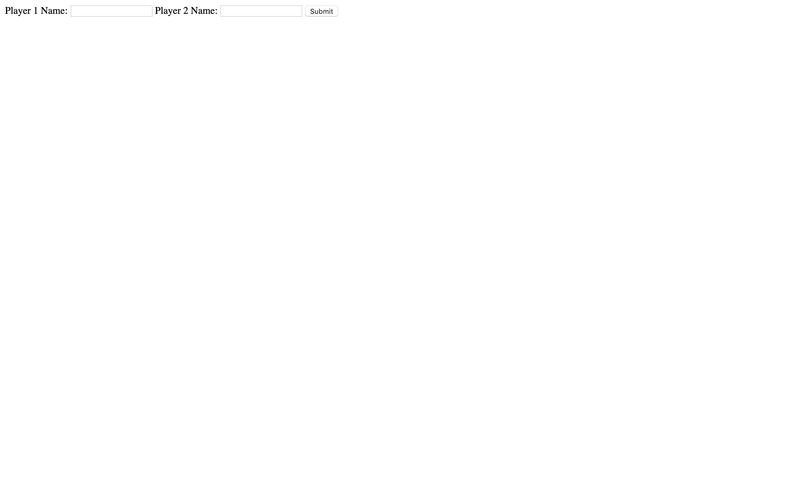

# Battle

Week 3 Afternon Challenge at Makers. This was a collaborative exercise, pairing every day with a different member of the cohort. The objectives of the week were to learn to test drive a web app using the MVC pattern. This way my first ever project using the MVC Pattern, as well as my first time creating a web app - using Ruby and Sinatra to display the .erb files.

I have left this app as it was in week 3 to serve as a progress marker and to show how far I have come since. Although the styling is basic, it's functionality is solid. The whole app was Test Driven with good coverage (using capybara and RSpec), logic resides in the Model, Views displays the html code and the controller connects the two together, directing to the appropiate path.

**The functionality of the app:**

A user can enter their name, a second user can enter their name, they will then progress through to the next stage to battle. The next page displays the Users who are battling - there are then corrosponding atatch buttons to reduce an opposing players HP points.

---

## How to Run

Clone this repo, and in the command line navigate to the [_Battle_](battle) directory. In the command line type in:

```
bundle install
```

Once the dependancies are installed, type in the command line:

```
rackup
```

Then visit [_localhost:9292_](http://localhost:9292/) in the browser.

To run the test suite (RSpec and Capybara), in the command line type:

```
rspec
```

This will display 11 passing tests with 100% coverage.

---

### Homepage



---

### Fight


---

### Attack


